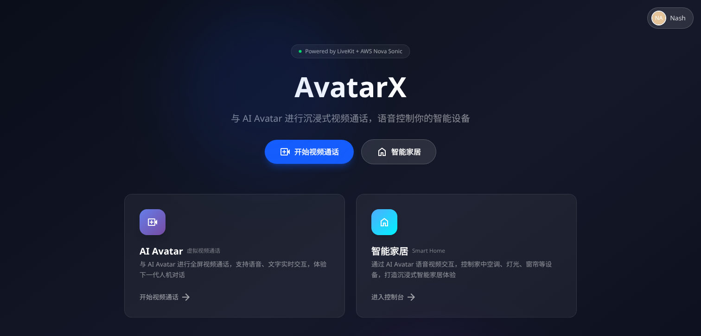

# AssistantX — Architecture & AWS Value Brief

> An AI voice‑assistant platform that runs an OIDC auth gateway, a LiveKit‑powered realtime voice agent, and a multi‑scene SolidJS frontend on Amazon EKS. Users talk or type; the agent understands intent with **AWS Bedrock Nova Sonic** speech‑to‑speech, executes device‑control actions over RPC, grounds answers with a **Bedrock Knowledge Base**, and responds with natural speech.



*Live at [https://assistantx.nx.run](https://assistantx.nx.run) — the AvatarX landing experience.*

---

## 1. Executive Summary

AssistantX is a production‑grade, cloud‑native reference implementation of a **realtime conversational AI assistant**. It demonstrates how to combine:

- **Low‑latency speech‑to‑speech (S2S)** AI using AWS Bedrock **Nova Sonic**,
- **Retrieval‑augmented generation (RAG)** using AWS Bedrock **Knowledge Bases**,
- **Tool / function calling** for real‑world device control (vehicle, smart‑home, EV charger),
- a **proto‑first, gRPC‑everywhere** API contract,
- and a fully **declarative Kubernetes + Helm** deployment on **Amazon EKS**, fronted by the **Envoy Gateway API**, **CloudFront**, and **AWS Global Accelerator**.

The result is an architecture that is strongly typed end‑to‑end, horizontally scalable, secure by default (IRSA, no long‑lived keys), and globally fast.

---

## 2. System Topology

```
                       ┌──────────────────────────────────────────────────────────┐
                       │                  AWS Cloud — us-west-2                     │
                       │                                                            │
                       │   CloudFront ──► assistantx.nx.run     (SolidJS SPA)       │
 Browser ─ HTTPS ──────┤                                                            │
 (SolidJS SPA)         │   Global Accelerator ──► assistantxapi.nx.run             │
        │              │        (ConnectRPC :443 · WSS :7883 · WebRTC TCP :7881)    │
        │ OIDC         │                          │                                 │
        ▼              │                          ▼                                 │
   OIDC IdP            │   ┌──────────── EKS (ns: assistantx) ──────────────────┐  │
 (account.nx.run)      │   │  Envoy Gateway  (HTTPRoute / TCPRoute ingress)      │  │
        ▲              │   │     ├── Frontend   (SolidJS + nginx :80)            │  │
        │ JWKS         │   │     ├── Backend    (Go, ConnectRPC :8080)           │  │
        └──────────────┼───┤     ├── LiveKit    (WSS :7880 / WebRTC TCP :7881)   │  │
                       │   │     └── Agent      (Python LiveKit voice agent)     │  │
                       │   └──────────────────────────┬──────────────────────────┘  │
                       │                               │                            │
                       │      Bedrock Nova Sonic (S2S) │ Bedrock KB (RAG)           │
                       │      Bedrock Claude (LLM/tools)│ AgentCore Memory (roadmap) │
                       │                  via IRSA (IAM + OIDC provider)            │
                       └──────────────────────────────────────────────────────────┘
```

A full visual is in **[`AssistantXArchitecture.drawio`](./AssistantXArchitecture.drawio)** (open with draw.io / diagrams.net; supports light & dark mode).

---

## 3. Components

| Component | Directory | Language | Responsibility |
|---|---|---|---|
| **Frontend** | `frontend/` | SolidJS + Tailwind v4 | Multi‑scene SPA (Avatar / SmartHome / Cockpit / Charger), ConnectRPC client, React micro‑island for the LiveKit chat/voice panel |
| **Backend** | `backend/` | Go (ConnectRPC) | OIDC auth gateway, JWT validation interceptor, LiveKit room‑token service, skill YAML delivery |
| **Agent** | `agent/` | Python (LiveKit Agents) | Realtime voice agent — Nova Sonic S2S, dynamic tool generation from skill YAML, action dispatch to the frontend, Bedrock Knowledge Base RAG |
| **LiveKit Server** | (in‑cluster) | livekit‑server | WebRTC SFU — WSS signaling (:7880/:7883) + media (TCP :7881) |
| **Helm chart** | `charts/` | Helm 3 | Declarative packaging of all of the above + Gateway API routes |

### 3.1 Proto‑first contract

Every interface is defined in `protos/` first, then generated for Go, TypeScript, and Python via `buf`. There are **no ad‑hoc REST endpoints**. This guarantees a single source of truth, type safety across three languages, and backward‑compatible evolution (`<domain>.v<N>` versioning).

Services: `auth.v1.AuthService` (PKCE flow, token exchange, userinfo), `livekit.v1.LivekitService` (room token, agent dispatch, skills), `irsa.v1.IRSAService` (credential info).

### 3.2 Realtime voice path

```
User speaks ──► LiveKit room ──► Agent (Nova Sonic RealtimeModel, S2S)
                                   │
                                   ├─ function tool call (e.g. hvac.setTemperature)
                                   │     └─ ActionDispatcher → RPC executeAction → Frontend store → UI update
                                   ├─ Knowledge Base retrieve (RAG grounding)
                                   └─ Nova Sonic streams speech back ──► User hears response
```

The agent loads device **skill YAML** per scene and generates LiveKit function tools dynamically, so new capabilities require only a YAML entry — no agent code change.

---

## 4. AWS Services & Their Value

AssistantX leans on managed AWS services so the team ships product, not undifferentiated infrastructure.

| AWS Service | Role in AssistantX | Value delivered |
|---|---|---|
| **Amazon EKS (Auto Mode)** | Hosts all four workloads | Managed, highly‑available Kubernetes control plane; **Karpenter** right‑sizes Graviton compute on demand → cost‑efficient, elastic scaling without node babysitting |
| **AWS Bedrock — Nova Sonic** | Realtime speech‑to‑speech engine | Single‑model S2S removes the STT→LLM→TTS pipeline latency and complexity; natural, low‑latency, interruptible voice with no GPU fleet to operate |
| **AWS Bedrock — Knowledge Bases** | RAG grounding (e.g. EV‑charger FAQ) | Fully managed vector store + retrieval; accurate, source‑grounded answers without standing up and operating a separate vector database |
| **AWS Bedrock — Claude (Haiku)** | LLM / tool‑calling in traditional mode | On‑demand frontier models via one API; pay‑per‑use, no model hosting |
| **CloudFront** | Global CDN for the SolidJS SPA | Edge caching + TLS termination → fast first paint worldwide, origin offload, DDoS absorption at the edge |
| **AWS Global Accelerator** | Anycast front door for backend / WSS / WebRTC | Static anycast IPs + AWS‑backbone routing → lower, more consistent latency for realtime RPC and media than public‑internet paths; fast cross‑AZ failover |
| **Envoy Gateway (Gateway API on EKS)** | L7/L4 ingress | Vendor‑neutral, declarative `HTTPRoute`/`TCPRoute`; one gateway terminates TLS for HTTP, WSS, and raw‑TCP WebRTC media on distinct listeners |
| **IAM + IRSA (OIDC provider)** | Pod‑level AWS credentials | Pods assume scoped IAM roles via the cluster OIDC provider — **no long‑lived access keys** in containers; least‑privilege Bedrock access |
| **Amazon ECR (Public)** | Container images + Helm OCI chart | Single registry for images and the versioned Helm chart → `helm install oci://…` with no repo clone |
| **Amazon CloudWatch** | Metrics, logs, observability | Centralized operational visibility into cluster and workloads |
| **Bedrock AgentCore Memory** *(roadmap)* | Persistent agent memory | See §6 — managed long‑/short‑term memory for personalized, continuous conversations |

**Why this matters:** the entire AI surface (speech, reasoning, retrieval, future memory) is consumed as **managed Bedrock APIs over IRSA**. There are no GPUs to provision, no model weights to host, no vector DB to operate, and no static credentials to rotate. The team scales conversational quality by changing configuration, not infrastructure.

---

## 5. Deployment & Operations

Everything is packaged as a single Helm chart (`charts/`) and driven by `scripts/deploy.sh`.

```bash
./scripts/deploy.sh helm       # helm upgrade --install only (reconcile cluster, no image build)
./scripts/deploy.sh backend    # build Go image  → push ECR → rollout restart
./scripts/deploy.sh agent      # build Python image → push ECR → helm upgrade
./scripts/deploy.sh frontend   # build nginx image → push ECR → rollout restart
./scripts/deploy.sh all        # build all images + push chart + deploy
./scripts/deploy.sh create-irsa-role NAME   # provision a least‑privilege IRSA role
```

Or install straight from the public OCI registry without cloning:

```bash
helm upgrade --install app \
  oci://public.ecr.aws/b1y9i2f3/assistantx --version 0.2.1 \
  --namespace assistantx --create-namespace \
  --set global.gateway=eg \
  --set global.gatewayNamespace=envoy-gateway-system \
  --set global.httpsListenerName=https \
  --set assistantx.host.frontend=assistantx.nx.run \
  --set assistantx.host.backend=assistantxapi.nx.run \
  --set assistantx.irsaRoleArn=arn:aws:iam::ACCOUNT:role/ROLE
```

### 5.1 Ingress / routing model

The Envoy `Gateway` (`eg`) exposes distinct listeners, and the chart binds one route to each:

| Route (HTTPRoute/TCPRoute) | Listener | Host | Backend |
|---|---|---|---|
| `assistantx-frontend` | `https` (:443) | `assistantx.nx.run` | `assistantx-frontend:80` |
| `assistantx-frontend-catchall` | `http` (:80) | (catch‑all) | `assistantx-frontend:80` |
| `assistantx-backend` | `https` (:443) | `assistantxapi.nx.run` | `assistantx-backend:8080` |
| `assistantx-livekit-wss` | `https-7883` (:7883) | `assistantxapi.nx.run` | `assistantx-livekit:7880` |
| `assistantx-livekit-tcp` | `tcp-7881` (:7881) | — | `assistantx-livekit:7881` |

Pinning the backend HTTPRoute to the named `https` listener (`global.httpsListenerName`) prevents it from accidentally matching the :7883 WSS listener — a subtle but important isolation guarantee.

### 5.2 Operational note — route reconciliation

The cluster's HTTPRoutes are reconciled by re‑running `./scripts/deploy.sh helm`, which performs `helm upgrade --install` against `charts/` and restarts the deployments. A drift in which the `assistantx-frontend-catchall` HTTPRoute was missing from the cluster was corrected this way: after the upgrade all four HTTPRoutes report `Accepted=True` / `ResolvedRefs=True`, the frontend serves `200` at `https://assistantx.nx.run/`, and the API returns `401` at `https://assistantxapi.nx.run/` (expected — it is an authenticating gateway).

---

## 6. Agent Memory (AgentCore Memory)

Today the agent is **stateless across sessions**: each LiveKit session loads skills, opens a Nova Sonic realtime session, and tears down when the user disconnects. Grounding knowledge comes from the Bedrock Knowledge Base, but there is no persistent recollection of *this user's* past conversations or preferences.

**Bedrock AgentCore Memory** is the planned layer to close that gap. It provides managed **short‑term** (within‑ and across‑session working context) and **long‑term** (durable user facts, preferences, summaries) memory for agents, so AssistantX can:

- Remember device preferences ("set my home AC to my usual 23°C"),
- Carry context across sessions ("continue where we left off"),
- Personalize responses from accumulated user history,

without the team building and operating its own memory store, embeddings pipeline, or retention logic.

**Integration sketch (roadmap):**

```
Session start ──► AgentCore Memory: recall(user_id, scene)  → seed RealtimeModel context
   … conversation …
Tool call / salient turn ──► AgentCore Memory: store(events / extracted facts)
Session end ──► AgentCore Memory: summarize & persist long‑term memory
```

Because it is a managed Bedrock capability reached via the same IRSA credentials the agent already uses for Nova Sonic and Knowledge Bases, adding it is a configuration + small‑code change, not new infrastructure. It is shown as a **dotted purple (roadmap)** node in the architecture diagram.

---

## 7. Security Posture

- **No static AWS keys in pods** — all AWS access (Bedrock, Knowledge Bases, future Memory) is via **IRSA** scoped IAM roles assumed through the EKS OIDC provider.
- **Centralized auth** — the Go backend validates OIDC JWTs (offline JWKS) in a single interceptor; every gRPC service inherits authentication, with no per‑handler auth code.
- **TLS everywhere at the edge** — CloudFront and the Envoy Gateway terminate TLS for HTTP, WSS, and WebRTC paths.
- **Least‑privilege by design** — `create-irsa-role` provisions roles from a minimal policy template (`scripts/irsa-policy.json`).

---

## 8. Why This Architecture Wins

1. **Managed AI, zero model ops** — speech, reasoning, retrieval, and (soon) memory are all Bedrock APIs. No GPUs, no model hosting, no vector DB to run.
2. **Global low latency** — CloudFront at the edge for the SPA; Global Accelerator on the AWS backbone for realtime RPC and WebRTC media.
3. **Elastic & cost‑aware** — EKS Auto Mode + Karpenter on Graviton scale compute to demand.
4. **Declarative & reproducible** — one Helm chart, one deploy script, Gateway‑API ingress; the whole stack installs from an OCI registry.
5. **Type‑safe & evolvable** — proto‑first contracts across Go, TypeScript, and Python.
6. **Secure by default** — IRSA, centralized OIDC auth, edge TLS, least privilege.

---

*Generated for the AssistantX project. Diagram: `docs/AssistantXArchitecture.drawio`. Screenshot: `docs/assistantx-screenshot.png`.*
