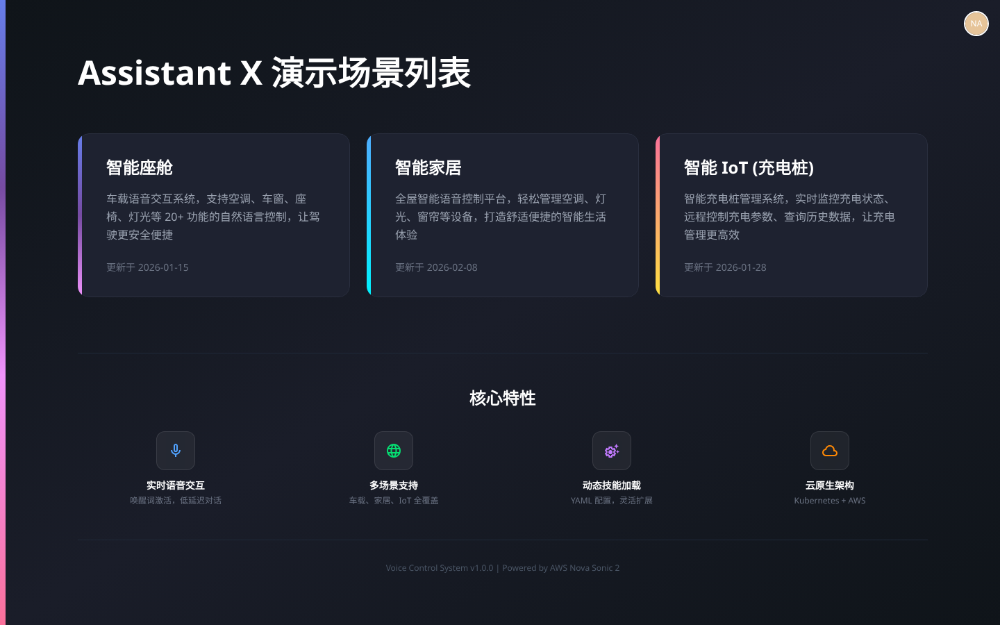
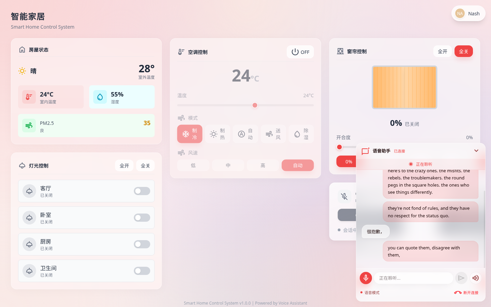
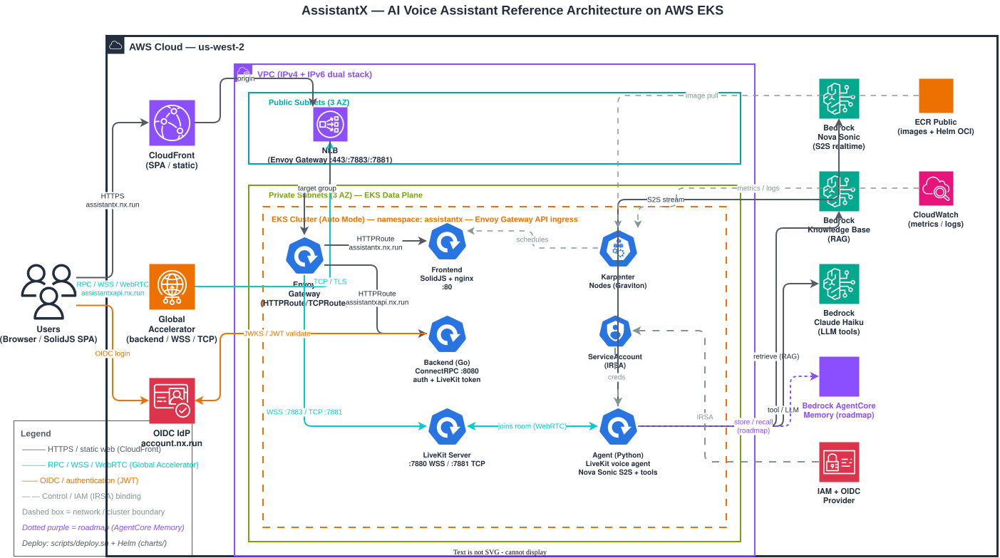

# AssistantX — Project Overview & AWS Architecture

> An AI voice‑assistant platform running on Amazon EKS. Users open a multi‑scene SolidJS web app, talk or type, and an AWS Bedrock **Nova Sonic** speech‑to‑speech agent understands intent, controls smart devices over RPC, grounds answers with a Bedrock **Knowledge Base**, and replies in natural speech.

**Live:** [https://assistantx.nx.run](https://assistantx.nx.run) · **Smart‑home scene with voice assistant:** [https://assistantx.nx.run/home](https://assistantx.nx.run/home)

---

## 1. What AssistantX Is

AssistantX is a production reference implementation of a **realtime conversational AI assistant** that controls real devices. It pairs a low‑latency voice interface with a typed, microservice backend and a fully declarative Kubernetes deployment on AWS.

Three demo scenes show the same agent driving different device domains:

| Scene | Route | Controls |
|---|---|---|
| **Smart Home** | `/home` | Lights, A/C (temp / mode / fan), curtains, environment readouts |
| **Cockpit (Vehicle)** | `/car` | HVAC, vehicle functions |
| **EV Charger** | `/charger` | Charging session, billing FAQ (RAG‑grounded) |

The user talks to the assistant; the agent calls **function tools** generated from device skill YAML and dispatches the resulting action back to the web UI over an RPC channel, so the on‑screen controls move in realtime as you speak.

---

## 2. Live Screenshots

### 2.1 Landing — scene selector (`/`)



The entry page lists the demo scenes (Smart Cockpit / Smart Home / Smart IoT EV Charger) and the core capabilities: realtime voice, multi‑scene control, low‑latency interaction, and cloud‑native scaling.

### 2.2 Smart Home with the voice assistant connected (`/home`)



The Smart‑Home control console with the **Voice Assistant** panel docked at the bottom‑right in the **Connected / Listening** state — a live LiveKit + Nova Sonic session. The mic is active, the transcript area is ready, and spoken commands ("turn on the living room light", "set the A/C to 24 degrees") drive the lighting, A/C, and curtain cards on the page in realtime.

---

## 3. Architecture

The full AWS reference architecture (light & dark‑mode aware SVG):



> Editable source: [`AssistantXArchitecture.drawio`](./AssistantXArchitecture.drawio) — open with [diagrams.net](https://app.diagrams.net).

### 3.1 Request & media flow

```
                       ┌──────────────────────────────────────────────────────────┐
                       │                  AWS Cloud — us-west-2                     │
                       │                                                            │
                       │   CloudFront ──► assistantx.nx.run     (SolidJS SPA)       │
 Browser ─ HTTPS ──────┤                                                            │
 (SolidJS SPA)         │   Global Accelerator ──► assistantxapi.nx.run             │
        │              │        (ConnectRPC :443 · WSS :7883 · WebRTC TCP :7881)    │
        │ OIDC         │                          │                                 │
        ▼              │                          ▼                                 │
   OIDC IdP            │   ┌──────────── EKS (ns: assistantx) ──────────────────┐  │
 (account.nx.run)      │   │  Envoy Gateway  (HTTPRoute / TCPRoute ingress)      │  │
        ▲              │   │     ├── Frontend   (SolidJS + nginx :80)            │  │
        │ JWKS         │   │     ├── Backend    (Go, ConnectRPC :8080)           │  │
        └──────────────┼───┤     ├── LiveKit    (WSS :7880 / WebRTC TCP :7881)   │  │
                       │   │     └── Agent      (Python LiveKit voice agent)     │  │
                       │   └──────────────────────────┬──────────────────────────┘  │
                       │                               │                            │
                       │      Bedrock Nova Sonic (S2S) │ Bedrock KB (RAG)           │
                       │      Bedrock Claude (LLM/tools)│ AgentCore Memory (roadmap) │
                       │                  via IRSA (IAM + OIDC provider)            │
                       └──────────────────────────────────────────────────────────┘
```

- **Frontend** (`assistantx.nx.run`) is static SolidJS served through **CloudFront** for global edge caching.
- **Backend / realtime** (`assistantxapi.nx.run`) goes through **AWS Global Accelerator** onto the AWS backbone — ConnectRPC on :443, LiveKit WSS signaling on :7883, and WebRTC media on TCP :7881 — for low, consistent latency.
- **Envoy Gateway** (Gateway API) terminates TLS and routes each host/port to the right in‑cluster service via `HTTPRoute` / `TCPRoute`.

### 3.2 Realtime voice path

```
User speaks ──► LiveKit room ──► Agent (Nova Sonic RealtimeModel, S2S)
                                   │
                                   ├─ function tool call (e.g. light.toggle, hvac.setTemperature)
                                   │     └─ ActionDispatcher → RPC executeAction → Frontend store → UI updates live
                                   ├─ Bedrock Knowledge Base retrieve (RAG grounding)
                                   └─ Nova Sonic streams speech back ──► User hears the reply
```

The agent loads device **skill YAML** per scene and generates LiveKit function tools dynamically — adding a new capability is a YAML entry, not agent code.

---

## 4. Components

| Component | Directory | Language | Responsibility |
|---|---|---|---|
| **Frontend** | `frontend/` | SolidJS + Tailwind v4 | Multi‑scene SPA, ConnectRPC client, React micro‑island for the LiveKit voice/chat panel |
| **Backend** | `backend/` | Go (ConnectRPC) | OIDC auth gateway, JWT validation interceptor, LiveKit room‑token service, skill delivery |
| **Agent** | `agent/` | Python (LiveKit Agents) | Realtime voice agent — Nova Sonic S2S, tool generation from skills, action dispatch, Bedrock KB RAG |
| **LiveKit Server** | in‑cluster | livekit‑server | WebRTC SFU — WSS signaling + TCP media |
| **Helm chart** | `charts/` | Helm 3 | Declarative packaging of all workloads + Gateway API routes |

**Proto‑first contract:** every interface is defined in `protos/` and generated for Go, TypeScript, and Python via `buf`. No ad‑hoc REST — one source of truth, type safety across three languages, versioned (`<domain>.v<N>`) evolution. Services: `auth.v1.AuthService`, `livekit.v1.LivekitService`, `irsa.v1.IRSAService`.

---

## 5. AWS Services & Their Value

| AWS Service | Role | Value delivered |
|---|---|---|
| **Amazon EKS (Auto Mode)** | Hosts all workloads | Managed, HA control plane; **Karpenter** right‑sizes Graviton compute on demand → elastic, cost‑efficient scaling |
| **Bedrock — Nova Sonic** | Realtime speech‑to‑speech | One‑model S2S removes STT→LLM→TTS latency/complexity; natural, interruptible voice with no GPU fleet to run |
| **Bedrock — Knowledge Bases** | RAG grounding | Managed vector store + retrieval; source‑grounded answers without operating a vector DB |
| **Bedrock — Claude (Haiku)** | LLM / tool‑calling | Frontier models on‑demand, pay‑per‑use, no model hosting |
| **CloudFront** | CDN for the SPA | Edge caching + TLS → fast first paint worldwide, origin offload, edge DDoS absorption |
| **AWS Global Accelerator** | Anycast front door for RPC/WSS/WebRTC | Static anycast IPs + backbone routing → lower, steadier realtime/media latency; fast failover |
| **Envoy Gateway (Gateway API)** | L7/L4 ingress on EKS | Vendor‑neutral, declarative routes; one gateway for HTTP, WSS, and raw‑TCP media |
| **IAM + IRSA (OIDC provider)** | Pod‑scoped AWS creds | Pods assume least‑privilege roles — **no long‑lived keys** in containers |
| **Amazon ECR (Public)** | Images + Helm OCI chart | One registry; `helm install oci://…` with no repo clone |
| **Amazon CloudWatch** | Metrics & logs | Centralized observability |
| **Bedrock AgentCore Memory** *(roadmap)* | Persistent agent memory | Managed short/long‑term memory for personalized, continuous conversations (see §7) |

**The big picture:** the entire AI surface — speech, reasoning, retrieval, and future memory — is consumed as **managed Bedrock APIs over IRSA**. No GPUs to provision, no model weights to host, no vector DB to operate, no static credentials to rotate. Conversational quality scales by configuration, not infrastructure.

---

## 6. Deployment & Operations

Everything is one Helm chart (`charts/`), driven by `scripts/deploy.sh`:

```bash
./scripts/deploy.sh helm       # helm upgrade --install (reconcile cluster, no build)
./scripts/deploy.sh backend    # build Go image  → push ECR → rollout restart
./scripts/deploy.sh agent      # build Python image → push ECR → helm upgrade
./scripts/deploy.sh frontend   # build nginx image → push ECR → rollout restart
./scripts/deploy.sh all        # build all + push chart + deploy
```

Install from the public OCI registry without cloning:

```bash
helm upgrade --install app \
  oci://public.ecr.aws/b1y9i2f3/assistantx --version 0.2.1 \
  --namespace assistantx --create-namespace \
  --set global.gateway=eg \
  --set global.gatewayNamespace=envoy-gateway-system \
  --set global.httpsListenerName=https \
  --set assistantx.host.frontend=assistantx.nx.run \
  --set assistantx.host.backend=assistantxapi.nx.run \
  --set assistantx.irsaRoleArn=arn:aws:iam::ACCOUNT:role/ROLE
```

### Ingress / routing model

| Route | Listener | Host | Backend |
|---|---|---|---|
| `assistantx-frontend` | `https` (:443) | `assistantx.nx.run` | `assistantx-frontend:80` |
| `assistantx-frontend-catchall` | `http` (:80) | (catch‑all) | `assistantx-frontend:80` |
| `assistantx-backend` | `https` (:443) | `assistantxapi.nx.run` | `assistantx-backend:8080` |
| `assistantx-livekit-wss` | `https-7883` (:7883) | `assistantxapi.nx.run` | `assistantx-livekit:7880` |
| `assistantx-livekit-tcp` | `tcp-7881` (:7881) | — | `assistantx-livekit:7881` |

Pinning the backend route to the named `https` listener (`global.httpsListenerName`) keeps it from accidentally matching the :7883 WSS listener. Routes are reconciled by re‑running `./scripts/deploy.sh helm`; healthy state is all routes `Accepted=True` / `ResolvedRefs=True`, frontend `200` at `https://assistantx.nx.run/`, and API `401` at `https://assistantxapi.nx.run/` (expected — it authenticates).

---

## 7. Agent Memory (AgentCore Memory)

Today the agent is **stateless across sessions**: each LiveKit session loads skills, opens a Nova Sonic realtime session, and tears down on disconnect. Grounding comes from the Bedrock Knowledge Base, but there is no persistent recollection of an individual user's past conversations or preferences.

**Bedrock AgentCore Memory** is the planned layer to close that gap, providing managed **short‑term** (within/across‑session working context) and **long‑term** (durable user facts, preferences, summaries) memory so AssistantX can:

- Remember device preferences ("set my home AC to my usual 23°C"),
- Carry context across sessions ("continue where we left off"),
- Personalize from accumulated history.

```
Session start ──► AgentCore Memory: recall(user_id, scene)  → seed RealtimeModel context
   … conversation …
Salient turn / tool call ──► AgentCore Memory: store(events / extracted facts)
Session end ──► AgentCore Memory: summarize & persist long‑term memory
```

Because it is reached via the same IRSA credentials the agent already uses for Nova Sonic and Knowledge Bases, adding it is a configuration + small‑code change, not new infrastructure. It appears as a **dotted purple roadmap node** in the architecture diagram.

---

## 8. Security Posture

- **No static AWS keys in pods** — all AWS access (Bedrock, Knowledge Bases, future Memory) via **IRSA** scoped IAM roles assumed through the EKS OIDC provider.
- **Centralized auth** — the Go backend validates OIDC JWTs (offline JWKS) in one interceptor; every gRPC service inherits authentication.
- **TLS everywhere at the edge** — CloudFront and Envoy Gateway terminate TLS for HTTP, WSS, and WebRTC paths.
- **Least privilege** — `create-irsa-role` provisions roles from a minimal policy template (`scripts/irsa-policy.json`).

---

## 9. Why This Architecture Wins

1. **Managed AI, zero model ops** — speech, reasoning, retrieval, and (soon) memory are all Bedrock APIs. No GPUs, no model hosting, no vector DB.
2. **Global low latency** — CloudFront at the edge for the SPA; Global Accelerator on the AWS backbone for realtime RPC and WebRTC media.
3. **Elastic & cost‑aware** — EKS Auto Mode + Karpenter on Graviton scale compute to demand.
4. **Declarative & reproducible** — one Helm chart, one deploy script, Gateway‑API ingress; installs from an OCI registry.
5. **Type‑safe & evolvable** — proto‑first contracts across Go, TypeScript, and Python.
6. **Secure by default** — IRSA, centralized OIDC auth, edge TLS, least privilege.

---

*Diagram: `docs/AssistantXArchitecture.svg` (source `.drawio`). Screenshots: `docs/screenshot-landing.png`, `docs/screenshot-home-voice.png` — captured live from `https://assistantx.nx.run`.*
